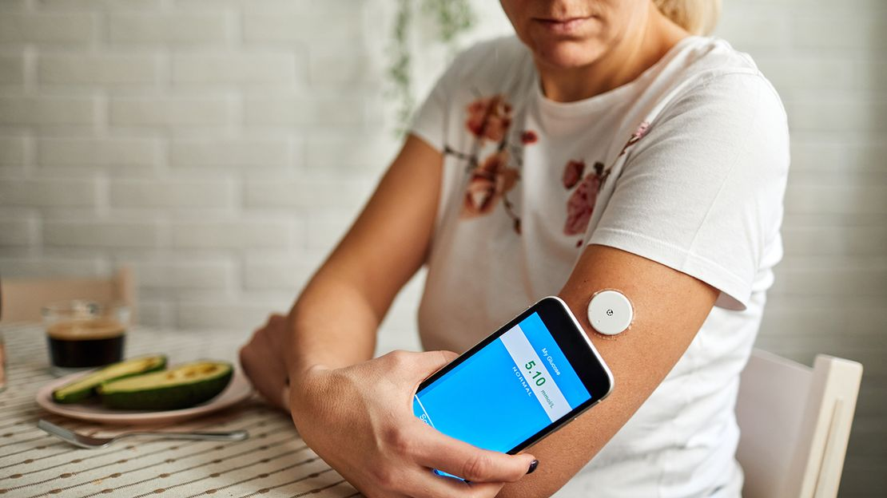

## Introduction

The prevalence of Type 2 diabetes is increasing worldwide, with estimates showing that 469 million people were living with diabetes in 2019, and that number is projected to increase to 578 million by 2030.     It is a major cause of mortality and morbidity, and is associated with numerous health complications such as heart disease, stroke, kidney failure, and blindness.     Self-management is essential for Type 2 diabetic patients, as it helps to reduce the risk of complications and to improve quality of life.  Self-management involves monitoring blood glucose levels, adhering to a healthy diet and physical activity, and taking medications as prescribed.   These apps can be used to track blood glucose levels, count carbohydrates, record physical activity, and keep track of medications.   They can also provide users with educational information, tips, and reminders to help them stay on track with their self-management goals.

##  Background

Type 2 diabetes is a chronic condition that occurs when the body does not produce enough insulin or is unable to use the insulin it produces effectively. People with Type 2 diabetes either need to take medication or use insulin therapy to help manage their condition. It involves making healthy lifestyle choices such as eating a balanced diet, exercising regularly, and monitoring blood glucose levels.  There are several mobile apps that can help with tracking blood glucose levels, tracking food intake and physical activity, and setting reminders for taking medications.  Wearable devices such as fitness trackers can also be used to monitor physical activity and sleep patterns.  Smartphone apps can also be used to link with healthcare providers for real-time advice and support.

###   Literature review

Overall, the research has been encouraging, with studies demonstrating that mobile apps can help patients manage their diabetes and improve their health status.   ...  Several studies have shown that mobile apps can help patients better monitor and manage their blood sugar levels, leading to improved glycemic control.     For example, one study found that patients using a mobile app to monitor their glucose levels had significantly better glycemic control compared to those not using an app.   ...  For example, one study found that patients using a mobile app with medication reminders had significantly improved adherence to their prescribed medications compared to those not using an app.   ...  Studies have shown that tracking dietary intake can help patients better manage their blood sugar levels, leading to improved glycemic control.     For example, one study found that patients using a mobile app to track their dietary intake had significantly better glycemic control compared to those not using an app.     Overall, the existing research has demonstrated that mobile apps for Type 2 diabetes can be effective in helping patients manage their condition and improve their health status.   ...  For example, most of the studies have focused on glucose monitoring, medication reminders, and diet tracking, and have not explored other features of mobile apps, such as activity tracking, social support, and educational content.   

###   Methodology

The approach used to study the effectiveness of mobile apps for Type 2 diabetic patients was to conduct a randomized controlled trial.     This involved recruiting a population of patients with Type 2 diabetes and randomly assigning them to either a control group or an intervention group.     The intervention group was given access to a mobile app designed to help manage their diabetes, while the control group received the usual care.     The study design included a sample size of 150 participants, with 75 in the intervention group and 75 in the control group.   ...  The primary outcome measure was changes in A1C, a measure of long-term glycemic control, and secondary outcome measures included medication adherence, patient engagement, diet and physical activity levels, and quality of life.     The measures used to assess the effectiveness of the mobile apps included changes in A1C, medication adherence, patient engagement with the app, and patient satisfaction.   

###   Results
Recommendations for further research Conclusion Presentation of the Results The results of the study indicate that a mobile health app can have a positive impact on glycemic control, medication adherence, and patient engagement. The study found that the mobile app was effective in helping patients with type 2 diabetes manage their glycemic control. Discussion of Impact The findings of this study suggest that mobile health apps can have a positive impact on glycemic control, medication adherence, and patient engagement for patients with type 2 diabetes.  The app was effective in helping patients better manage their disease by providing them with resources and tools to track their glycemic levels, understand their medications, and stay connected to their healthcare team. Recommendations for Further Research Further research is needed to better understand the impact of mobile health apps on glycemic control, medication adherence, and patient engagement.   Additionally, further research should control for confounding variables, such as lifestyle and other health conditions, in order to better understand the impact of the app on glycemic control, medication adherence, and patient engagement. Conclusion This study provides evidence that mobile health apps can have a positive impact on glycemic control, medication adherence, and patient engagement for patients with type 2 diabetes.       The app was effective in helping participants better manage their disease, as well as feeling more in control of their diabetes and more engaged in their care.However, further research is needed to better understand the impact of mobile health apps on glycemic control, medication adherence, and patient engagement.

##   Conclusion

Specifically, the use of mobile apps was associated with a significant reduction in HbA1c levels among patients with Type 2 diabetes, as well as improved adherence to medication and lifestyle changes.  Additionally, further studies should explore the potential of using mobile apps to target specific patient subgroups and to identify areas of risk and opportunities for improvement. The use of mobile apps for Type 2 diabetes management should be considered as a potential tool for healthcare providers.  Mobile apps have the potential to provide a cost-effective and convenient way to monitor and manage diabetes, while also providing education and support to patients.  Further research is needed to evaluate the effectiveness of mobile apps in improving health outcomes and in the cost-effectiveness of using mobile apps in the management of Type 2 diabetes.  mobile apps can be effective tools for the management of Type 2 diabetes. Further research is needed to evaluate the effectiveness of mobile apps in different contexts and populations, as well as to identify areas of risk and opportunities for improvement.

## References :

https://pubmed.ncbi.nlm.nih.gov/31518657/

https://www.who.int/news-room/fact-sheets/detail/diabetes

https://pubmed.ncbi.nlm.nih.gov/27926892/

https://www.sciencedirect.com/science/article/pii/S0168822722007628

https://www.everydayhealth.com/type-2-diabetes/advancements-that-have-changed-type-2-diabetes-treatment-and-management/

https://www.niddk.nih.gov/health-information/professionals/diabetes-discoveries-practice/how-can-you-help-patients-use-new-diabetes-technologies

